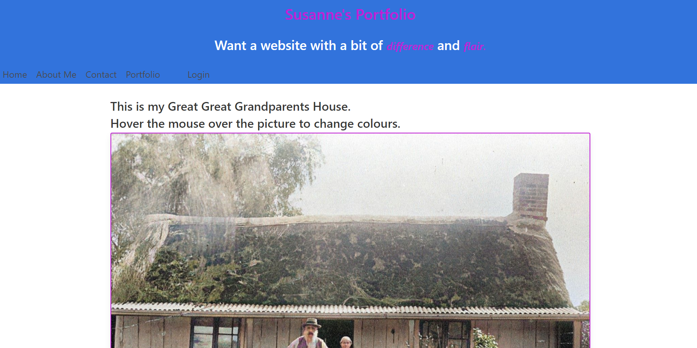

# Susanne's Portfolio

[](https://opensource.org/licenses/MIT)

## Description

This is an applicaion in which I showcase three applications that I have built.
The first application is an application that utilises third party APIs to allow a user to find the weather for any town/city in Australia.
  
The second application is an application that demonstrates my understanding of client server applications and modelling of data to undertake SQL searches of data.  The application allows a user to enter a blog on a technical subject, login into the application which then allows them to add comments to any blog, and update or detail their own blogs.

The third application demonstrates use of third party APIs, client server processing and the Model - View - Controller architecture.  The third application is an appointment booking application that allows a user to book, edit, delete and search for their appointments.  It is invoked in Heroku.


## 📖Table of Contents
1. [Installation](#installation)
2. [Usage](#usage)
3. [Assets](#assets)
4. [Technologies](#technologies)
5. [License](#license)
6. [Contributing](#contributing)
7. [Tests](#tests)
8. [Questions](#questions)

## Installation
1. To install this application clone it through GitHub using the following code in the terminal: 
    ``` 
    git clone https://github.com/Susanne85/final-portfolio
    ```
2. To add the dependencies to the application, navigate to the root directory for the application and run:
    ```js
    npm install
    npm install dotenv
    npm install express
    npm install mysql2
    npm install sequelize
    npm install bcrypt
    npm install nodemon
    npm install pdfreader
    ```
    
## Usage
Once the host, port, user, password and database details have been provided to the connection and the database has been created, navigate to the root directory for the application and run the following code in the terminal to start the application:

```js
npm start
```

## Assets

The following images shows the functionality of the application: 




## Technologies
- [Node.js](https://nodejs.org/en/docs/)
- [dotenv](https://www.npmjs.com/package/dotenv)
- [Express](https://expressjs.com/)
- [mysql2](https://www.npmjs.com/package/mysql2)
- [Nodemon](https://www.npmjs.com/package/nodemon)
- [Sequelize](https://sequelize.org/v5/index.html)
- [bcrypt](https://www.npmjs.com/package/bcrypt)
- [Connect Session Sequelize](https://www.npmjs.com/package/connect-session-sequelize)
- [Express Handlebars](https://www.npmjs.com/package/express-handlebars)
- JavaScript

## License

This project is [MIT](./LICENSE) licensed

## Contributing
Contributions, issues and feature requests are welcome.

Feel free to check the [issues page](https://github.com/Susanne85/final-portfolio/issues) if you want to contribute.

## Tests
There are no tests currently for this application.


## Questions
For any questions, please contact the author:

- Github: [@Susanne](https://github.com/Susanne85)
